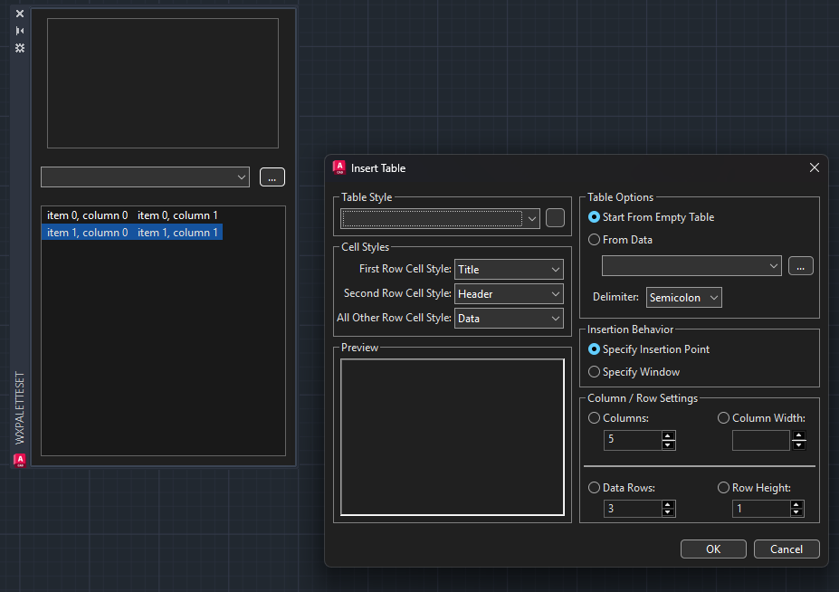

# WxArx

## This is a quick example of using wxWidgets with ObjectARX

- Attach to CAD's main frame.
- Create a wrapper for CAdUiPaletteSet/CAdUiPalette
- Create a modal dialog
- Load a .XRC resource

## How to build

- Build wxWidgets as a static library withe compiler that's compatible with your ARX project
- Buld the project against your ObjectARX SDK

## Creating XRC files

I use [DialogBlocks](http://www.anthemion.co.uk/dialogblocks/) to generate XRC files. DialogBlocks will also genreate C++ events

